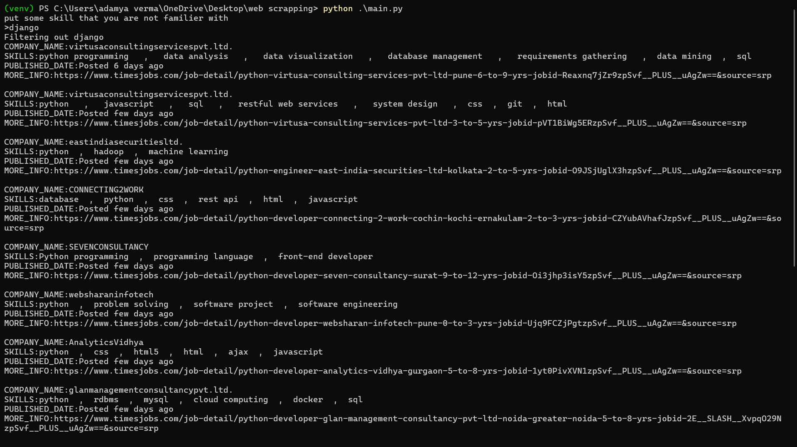

# Job Scraping Script

This Python script scrapes job listings from the TimesJobs website based on a specified skill filter and filters out jobs that require a specified unfamiliar skill.

## Requirements

- Python 3.x
- Requests library (`pip install requests`)
- BeautifulSoup library (`pip install beautifulsoup4`)
- lxml parser (`pip install lxml`)

## Installation

1. **Clone the repository:**
   ```bash
   git clone https://github.com/Kirito-89/web-scrapping.git
2. **Run the code:**
   ```bash
   python ./main.py
   
## output
